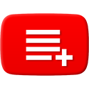

 

<h1 align="center">Playlist Subscriber for Youtube</h1>

Enables you to subscribe to any Youtube playlist.
Introducing the "Playlist Subscription" feature, allowing you to subscribe to your favorite Youtube playlists with one click!

Adds a "Subscribe" button to every Youtube playlist page. Once you subscribe to a playlist, you'll receive recently added videos to your subscription box. This means you can keep track of your favorite series' from a channel without being bombarded with unwanted uploads.

